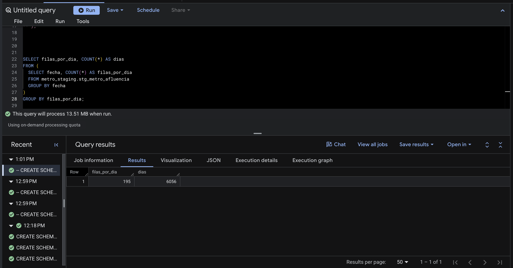
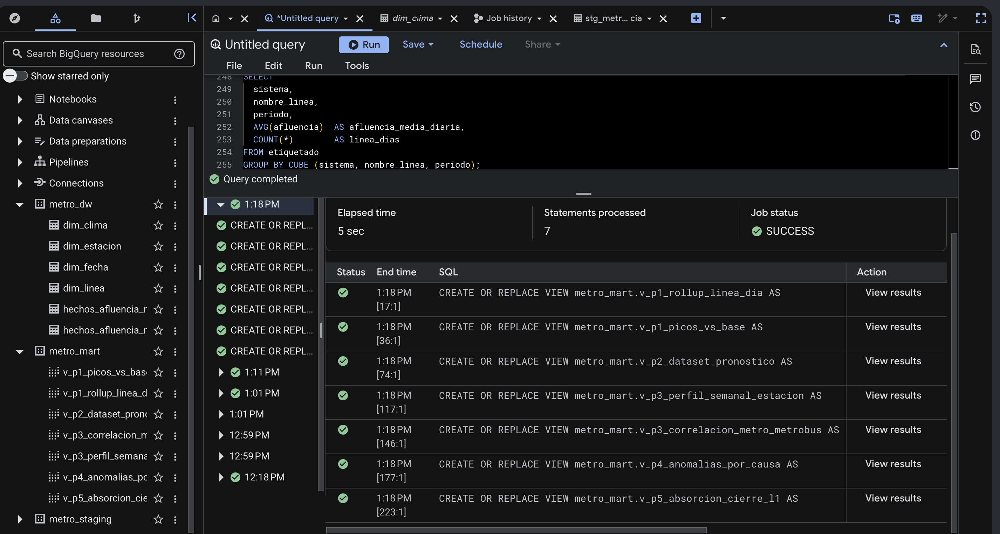
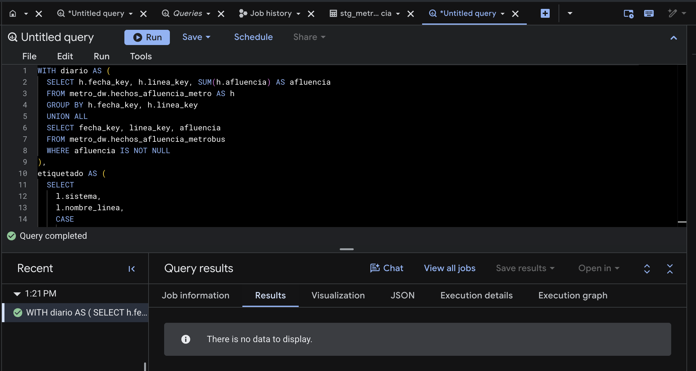

## 2.1 Las tres capas

```{mermaid}
flowchart LR
    subgraph F["Fuentes"]
        F1["F1 · Afluencia Metro<br/>CSV portal"]
        F2["F2 · Afluencia Metrobús<br/>CSV portal"]
        F3["F3 · GTFS<br/>ZIP portal"]
        F4["F4 · Festivos<br/>API REST"]
        F5["F5 · Clima<br/>API REST"]
    end
    subgraph S["metro_staging · datos crudos"]
        S1[stg_metro_afluencia]
        S2[stg_metrobus_afluencia]
        S3[stg_gtfs_stops<br/>stg_gtfs_routes]
        S4[stg_festivos_nager]
        S5[stg_clima_openmeteo]
    end
    subgraph D["metro_dw · esquema estrella"]
        H1[(hechos_afluencia_metro)]
        H2[(hechos_afluencia_metrobus)]
        DIM["dim_fecha · dim_linea<br/>dim_estacion · dim_clima"]
    end
    subgraph M["metro_mart · vistas OLAP"]
        V["v_p1 … v_p5"]
    end
    F1 --> S1
    F2 --> S2
    F3 --> S3
    F4 --> S4
    F5 --> S5
    S1 & S2 & S3 & S4 & S5 -. "ETL en E2" .-> D
    D --> M
```

| Capa | Dataset | Contenido | Estado en E1 |
|------|---------|-----------|--------------|
| **Staging** | `metro_staging` | Datos **crudos**, tal como vienen de cada fuente. Todas las columnas de los CSV se cargan como `STRING` para no perder nada: los ceros, los `'NaN'` y el texto mal codificado se conservan | Cargado |
| **DW** | `metro_dw` | Esquema estrella: 2 hechos y 4 dimensiones, creados con DDL | Creado y **vacío** (se puebla en E2) |
| **DataMart** | `metro_mart` | Una vista por pregunta de E0, con lógica OLAP, sobre el esquema estrella | Vistas creadas; devuelven 0 filas hasta poblar el DW |

Los tres datasets están en la **misma ubicación (`US`)**, así que las consultas pueden cruzar capas. Se crearon con [`sql/00_datasets.sql`](sql/00_datasets.sql).

::: {layout-ncol=2}


:::

## 2.2 Capa staging

Cada tabla corresponde a una fuente del [catálogo](fuentes.qmd). Se cargó desde la consola de BigQuery (*Crear tabla → Subir*) con el esquema escrito a mano en lugar de autodetectado.

| Tabla | Fuente | Archivo cargado | Filas | Fecha de carga |
|-------|--------|-----------------|-------|----------------|
| `stg_metro_afluencia` | [F1](fuentes.qmd#f1) | CSV completo del portal (59.9 MB) | 1,180,920 | [AAAA-MM-DD]{.todo} |
| `stg_metrobus_afluencia` | [F2](fuentes.qmd#f2) | CSV completo del portal (2.1 MB) | 53,732 | [AAAA-MM-DD]{.todo} |
| `stg_gtfs_stops` | [F3](fuentes.qmd#f3) | `stops.txt` del ZIP GTFS | 11,362 | [AAAA-MM-DD]{.todo} |
| `stg_gtfs_routes` | [F3](fuentes.qmd#f3) | `routes.txt` del ZIP GTFS | 301 | [AAAA-MM-DD]{.todo} |
| `stg_festivos_nager` | [F4](fuentes.qmd#f4) | JSONL generado por `staging/descargar_apis.py` | 156 | [AAAA-MM-DD]{.todo} |
| `stg_clima_openmeteo` | [F5](fuentes.qmd#f5) | CSV generado por `staging/descargar_apis.py` | 6,056 | [AAAA-MM-DD]{.todo} |

Los valores se cargan sin tocar. Hay solo dos ajustes de forma, ambos impuestos por BigQuery:

- **F4:** la API devuelve un arreglo JSON por año y BigQuery requiere un objeto por línea (JSONL).
- **F5:** los encabezados originales traen espacios, paréntesis y `°` (`precipitation_sum (mm)`, `temperature_2m_max (°C)`), que no son válidos en un nombre de columna. Se omite la fila de encabezado y las columnas se nombran por posición, conservando la unidad en el nombre: `precipitation_sum_mm`, `temperature_2m_max_c`.

### Evidencia de carga

Cada tabla se muestra con su esquema (a la izquierda) y su vista previa (a la derecha). El contador de la vista previa confirma el número de filas del catálogo.

::: {layout-ncol=2}


:::

::: {layout-ncol=2}



:::

Las consultas de perfilado, que confirman en BigQuery lo que encontramos en el portal, están en [`sql/01_perfilado_staging.sql`](sql/01_perfilado_staging.sql).

## 2.3 Capa DW

El esquema estrella, su grano y el DDL completo están en [Esquema estrella](estrella.qmd). Las tablas se crearon con [`sql/ddl_dw.sql`](sql/ddl_dw.sql) y quedaron vacías, como pide el alcance de E1.

## 2.4 Capa DataMart

Hay una vista por pregunta de E0. P1 y P3 tienen dos vistas cada una porque combinan dos lecturas distintas. El código completo está en [`sql/consultas_mart.sql`](sql/consultas_mart.sql).

| Vista | Pregunta | Operador OLAP | Qué devuelve |
|-------|----------|---------------|--------------|
| `v_p1_rollup_linea_dia` | P1 | **ROLLUP** | Afluencia media por línea y día de la semana, con subtotal por línea y total de la red |
| `v_p1_picos_vs_base` | P1 | **Ventanas** (`AVG OVER`, `RANK`) | Índice de cada estación-día contra su propia base y las 20 estaciones más cargadas por día |
| `v_p2_dataset_pronostico` | P2 | **Ventanas** (`LAG`, `AVG … ROWS BETWEEN`) | Conjunto de entrenamiento: rezagos t−1 y t−7, línea base ingenua de 4 semanas (la del criterio de éxito) y etiqueta de alta demanda |
| `v_p3_perfil_semanal_estacion` | P3 | **PIVOT** + ventana | Perfil semanal normalizado por estación: la matriz de entrada del clustering |
| `v_p3_correlacion_metro_metrobus` | P3 | Agregación `CORR` | Correlación diaria entre cada línea del Metro y cada línea del Metrobús |
| `v_p4_anomalias_por_causa` | P4 | **Ventanas** + **GROUPING SETS** | Estación-días con \|z\| ≥ 3 contra las 8 semanas previas, contados por festivo, lluvia y estado de servicio |
| `v_p5_absorcion_cierre_l1` | P5 | **CUBE** | Afluencia media diaria por sistema, línea y periodo (antes, durante y después del cierre de L1) |

```sql

```

### Evidencia de validez en BigQuery

::: {layout-ncol=2}



:::
