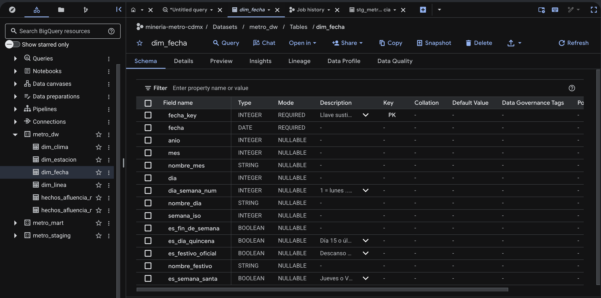
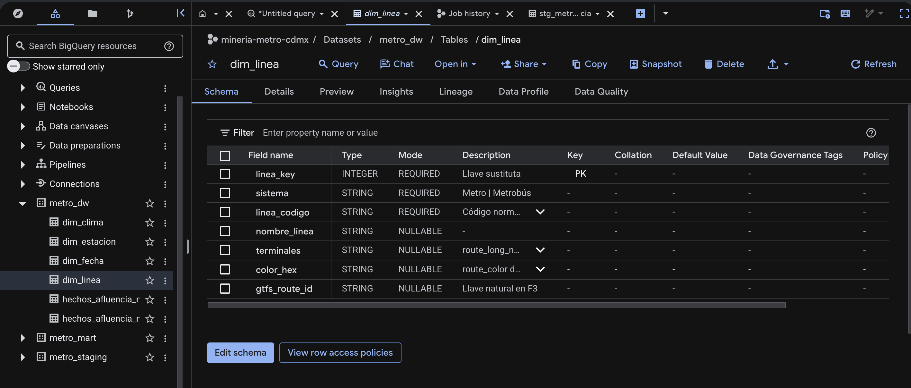
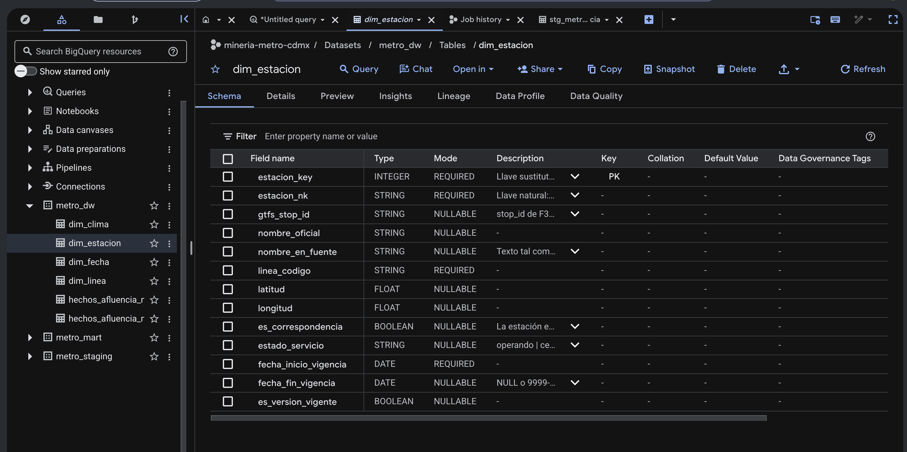
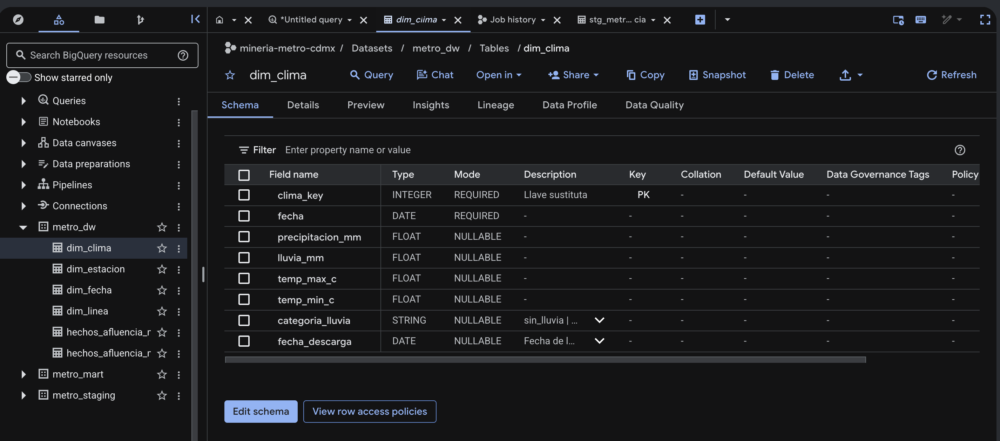
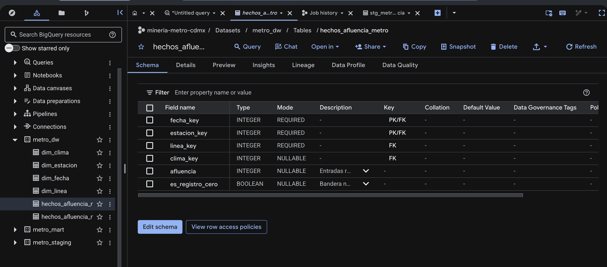
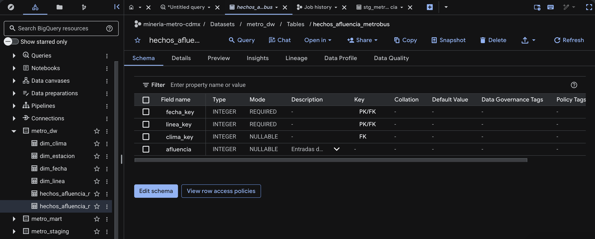

## 3.1 Granos candidatos

Los granos se listan a partir de lo que las fuentes **realmente** publican, revisado en la [sección 1.4](fuentes.qmd#lo-que-encontramos-al-abrir-los-datos), no a partir de lo que imaginábamos en E0.

| Grano candidato | Lo sustenta | Preguntas que permite | Preguntas que pierde |
|-----------------|-------------|-----------------------|----------------------|
| **G1 · estación-línea × día** | F1: 195 filas por día, 2010–2026 | P1, P2, P3, P4 completas; P5 al agregar a línea | Ninguna de E0 (la hora ya se había descartado en E0, riesgo R1) |
| G2 · estación-línea × día × tipo de pago | Metro desglosada (C6): solo desde 2021 | Las mismas que G1, con menos historia | Ninguna pregunta usa el medio de pago: `dim_tipo_pago` sería **huérfana** |
| G3 · línea × día | Común denominador de F1 y F2 | P5 | P1, P2, P3 y P4, que son por estación |

## 3.2 Grano elegido

::: {.caja .caja-clave}
[Grano del hecho principal]{.etiqueta}
**Una fila por estación-línea del Metro por día.**

[Grano del hecho secundario]{.etiqueta}
**Una fila por línea de Metrobús por día.**
:::

**Por qué G1.** Es el grano más fino que existe en las fuentes y coincide exactamente con el objetivo de minería de E0: un pronóstico diario por estación con 24 h de antelación. Por eso no hace falta pivote.

**Por qué un segundo hecho.** Metrobús no publica afluencia por estación, solo por línea. Mezclar ambos sistemas en una sola tabla obligaría a bajar todo al grano G3 y a perder P1–P4. Con dos hechos que comparten `dim_fecha`, `dim_linea` y `dim_clima` conformadas, cada sistema conserva su grano nativo y P3 y P5 se responden cruzando por fecha y línea.

**Qué ya no se puede responder, con honestidad:**

- Nada a nivel de **hora**: no existe en ninguna fuente pública (riesgo R1 de E0, ya asumido).
- La **alternativa de Metrobús por estación** de P3: solo se puede proponer a nivel de línea (ver [trazabilidad](trazabilidad.qmd)).
- La **ocupación del vagón**: la afluencia cuenta entradas, no ocupación (riesgo R4 de E0).

## 3.3 Tablas de hechos y medidas

| Hecho | Medida | Tipo | Aditividad |
|-------|--------|------|------------|
| `hechos_afluencia_metro` | `afluencia` | INT64 | **Aditiva** en todas las dimensiones: sumar entradas por estaciones, líneas o días da el total de entradas |
| `hechos_afluencia_metro` | `es_registro_cero` | BOOL | **No aditiva**: bandera para filtrar ceros (cierres de un día) |
| `hechos_afluencia_metrobus` | `afluencia` | INT64 | **Aditiva**; `NULL` cuando la fuente reporta `'NaN'`, porque la línea aún no existía |

Los promedios, índices contra la base y z-scores **no se guardan** en el hecho: se calculan en el DataMart, porque no son aditivos.

## 3.4 Dimensiones

| Dimensión | Llave sustituta | Atributos principales | SCD | Por qué ese tipo |
|-----------|-----------------|------------------------|-----|------------------|
| `dim_fecha` | `fecha_key` (INT64 `AAAAMMDD`) | fecha, año, mes, día de la semana, semana ISO, fin de semana, quincena, festivo oficial, Semana Santa | **Tipo 0** | Los atributos de un día del calendario no cambian. Los festivos se validan una vez contra la LFT al cargar |
| `dim_linea` | `linea_key` | sistema (Metro / Metrobús), código, nombre, terminales, color, `gtfs_route_id` | **Tipo 1** | Un cambio de color o de nombre de terminal es una corrección; ninguna pregunta necesita su historia, así que se sobrescribe |
| `dim_estacion` | `estacion_key` (una por versión) | llave natural, `gtfs_stop_id`, nombre oficial, nombre en la fuente, línea, coordenadas, correspondencia, **estado de servicio**, vigencia | **Tipo 2** en `estado_servicio`; tipo 1 en el nombre | Los **periodos sin servicio** son cambios reales que necesitan historia: L12 cerrada desde 2021-05-04 con reapertura parcial en 2023 y total en 2024, L1 en obra de 2022 a 2025 y L12 antes de su inauguración en 2012. Cada periodo es una versión con fechas de vigencia: P2 excluye tramos cerrados, P4 explica anomalías por cierre y P5 compara antes, durante y después. El **nombre** se sobrescribe (tipo 1) porque F1 reescribe hacia atrás el nombre vigente: *Zócalo/Tenochtitlan* aparece desde 2010, así que la fuente no permite reconstruir su historia |
| `dim_clima` | `clima_key` | fecha, precipitación, lluvia, temperatura máxima y mínima, categoría de lluvia, fecha de descarga | **Tipo 1** | Open-Meteo es un reanálisis y puede corregir días recientes. Se sobrescribe con la descarga más nueva, registrando su fecha |

`dim_linea`, `dim_fecha` y `dim_clima` son **dimensiones conformadas**: las usan los dos hechos con el mismo significado.

## 3.5 Diagrama

```{mermaid}
erDiagram
    DIM_FECHA ||--o{ HECHOS_AFLUENCIA_METRO : fecha_key
    DIM_ESTACION ||--o{ HECHOS_AFLUENCIA_METRO : estacion_key
    DIM_LINEA ||--o{ HECHOS_AFLUENCIA_METRO : linea_key
    DIM_CLIMA ||--o{ HECHOS_AFLUENCIA_METRO : clima_key
    DIM_FECHA ||--o{ HECHOS_AFLUENCIA_METROBUS : fecha_key
    DIM_LINEA ||--o{ HECHOS_AFLUENCIA_METROBUS : linea_key
    DIM_CLIMA ||--o{ HECHOS_AFLUENCIA_METROBUS : clima_key

    HECHOS_AFLUENCIA_METRO {
        INT64 fecha_key FK
        INT64 estacion_key FK
        INT64 linea_key FK
        INT64 clima_key FK
        INT64 afluencia "aditiva"
        BOOL es_registro_cero "no aditiva"
    }
    HECHOS_AFLUENCIA_METROBUS {
        INT64 fecha_key FK
        INT64 linea_key FK
        INT64 clima_key FK
        INT64 afluencia "aditiva, NULL si NaN"
    }
    DIM_FECHA {
        INT64 fecha_key PK "AAAAMMDD, SCD 0"
        DATE fecha
        INT64 anio
        INT64 mes
        INT64 dia_semana_num
        BOOL es_dia_quincena
        BOOL es_festivo_oficial
        BOOL es_semana_santa
    }
    DIM_LINEA {
        INT64 linea_key PK "SCD 1"
        STRING sistema "Metro o Metrobus"
        STRING linea_codigo
        STRING nombre_linea
        STRING color_hex
        STRING gtfs_route_id
    }
    DIM_ESTACION {
        INT64 estacion_key PK "SCD 2"
        STRING estacion_nk
        STRING gtfs_stop_id
        STRING nombre_oficial
        STRING linea_codigo
        FLOAT64 latitud
        FLOAT64 longitud
        STRING estado_servicio
        DATE fecha_inicio_vigencia
        DATE fecha_fin_vigencia
    }
    DIM_CLIMA {
        INT64 clima_key PK "SCD 1"
        DATE fecha
        FLOAT64 precipitacion_mm
        FLOAT64 temp_max_c
        STRING categoria_lluvia
    }
```

## 3.6 DDL ejecutado en BigQuery

El código completo está en [`sql/ddl_dw.sql`](sql/ddl_dw.sql). Las tablas quedan **vacías**: poblarlas es trabajo de E2.

```sql

```

### Esquema de cada tabla en BigQuery

::: {layout-ncol=2}











:::
